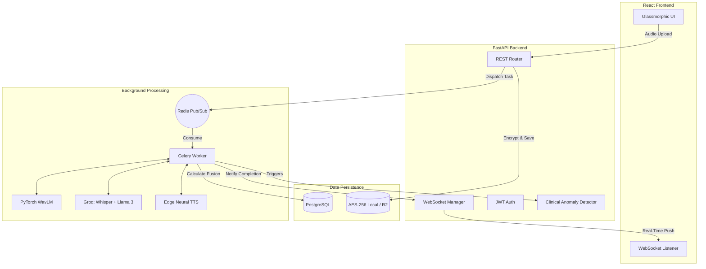

<div align="center">
  
  <h1>Voice Journal AI</h1>
  <p><strong>A beautifully crafted, multimodal AI voice journaling platform that analyzes your acoustic emotions, tracks mental well-being, and talks back to you.</strong></p>
  
  <p>
    
    
    
    
    
    <a href="https://github.com/AnkitKumarIISERB/Voicejournal/actions/workflows/ci.yml"></a>
  </p>

  <h3>
    <a href="https://voicejournal-app.vercel.app" target="_blank">🌐 Try the Live Demo Here</a>
  </h3>
  
  <table>
    <tr>
      <td><strong>Recruiter Demo Account</strong></td>
      <td><code>Email: demo@voicejournal.ai</code><br/><code>Password: password123</code></td>
    </tr>
  </table>
</div>

<br/>

<div align="center">
  
  
  
</div>

<br/>

## 🎥 Video Walkthrough

> **[Loom Video Link Here - Replace me!]** 
> 
> Watch a full 2-minute demo of the application capturing live audio, generating the 60/40 multimodal fusion analysis, and talking back using the Neural Voice agent.

---

## 📖 The Motivation: Why Voice Journal?

Traditional journaling is highly beneficial for mental health, but typing out thoughts when overwhelmed or exhausted is a massive friction point. **Voice Journal AI** removes this barrier by allowing users to simply speak their mind. 

By capturing raw audio, the platform doesn't just transcribe text—it performs a **multimodal analysis** of both *what* you said (semantics) and *how* you said it (acoustic emotion) to build a longitudinal emotional profile.

---

## 🧠 ML Pipeline & Multimodal Fusion

Unlike simple wrapper apps, this project implements a **60/40 Multimodal Fusion Strategy** to accurately gauge human emotion:

1. **Acoustic Emotion (40% Weight):** 
   - The raw audio is processed using a **WavLM** model (fine-tuned on the RAVDESS dataset) via PyTorch.
   - It extracts deep acoustic features (pitch, jitter, shimmer) to determine if the speaker's actual voice sounds distressed, exhausted, or joyful.
2. **Semantic Sentiment (60% Weight):**
   - The audio is transcribed via **Whisper**, and the text is passed to **Llama-3.1-8b** via Groq.
   - Llama-3 performs deep semantic context analysis (detecting sarcasm, passive-aggressiveness, or explicit statements).
3. **Fusion & Clinical Anomaly Detection:**
   - The two scores are fused into a final Continuous Valence Score (-1.0 to +1.0).
   - A background chron-job scans for **Crisis Anomalies** (e.g., a sudden valence drop of >0.5, or 3+ sustained negative days) and triggers ethical crisis helpline alerts.

---

## ✨ Clever Engineering Tricks

- **The Hinglish TTS Trick:** To create an empathetic AI therapist without massive cloud bills, the chatbot uses the undocumented **Microsoft Edge Neural TTS engine**. It dynamically swaps between English and Hinglish neural voices depending on the user's input language, achieving ultra-lifelike, zero-cost voice synthesis.
- **Whisper Translate Mode:** Instead of building a complex multi-language router, the Whisper API is invoked in `translate` mode, automatically normalizing regional dialects and languages into English text before feeding it to Llama-3, saving precious token context limits.

---

## 🏗️ System Architecture & Data Flow

Voice Journal AI is designed as a decoupled, scalable, event-driven system.

1. **Audio Ingestion**: Client records audio via MediaRecorder API and POSTs `multipart/form-data`.
2. **AES-256 Storage**: Backend immediately encrypts audio locally (designed to swap easily with AWS S3/R2 via a repository pattern).
3. **Async Task Routing**: A task is published to **Redis Pub/Sub**, and the FastAPI server immediately returns a `202 Accepted` to unblock the client.
4. **Celery Worker Pipeline**: The worker processes the WavLM PyTorch acoustic analysis and Groq Whisper/Llama-3 text analysis in parallel.
5. **Real-Time Push**: Once fusion is complete, the Celery worker notifies the frontend over a live **WebSocket connection**, causing the Recharts UI to dynamically update.



---

## ⚖️ Technical Decisions (The "Why")

- **Why Celery + Redis instead of FastAPI `BackgroundTasks`?**
  FastAPI's built-in background tasks run in the same event loop as the web server. Since WavLM PyTorch inference is heavily CPU-bound, it would cause event loop blocking, dropping incoming HTTP requests. Decoupling via Celery ensures web server throughput remains high.
- **Why Asyncpg & SQLAlchemy 2.0?**
  To maximize concurrency for WebSocket connections and database queries, the app uses `asyncpg` drivers with SQLAlchemy's `AsyncSession`, allowing thousands of concurrent users without thread starvation.
- **Why Local Storage for Dev instead of S3?**
  To make this repo easily runnable by anyone, I implemented a Local AES-256 storage provider. The storage class is written to an interface, meaning swapping to AWS S3 or Cloudflare R2 in production simply requires changing the `STORAGE_BACKEND` env variable.

---

## ⚠️ Honest Known Limitations

No architecture is perfect. If I were scaling this to 100,000 users, I would address the following:
1. **Render Cold Starts**: The backend is hosted on Render's free tier. If the API hasn't been hit in 15 minutes, the first audio upload takes ~50 seconds to process while the container spins up. 
2. **Free-Tier RAM Constraints**: PyTorch WavLM models require ~2GB of RAM. Because Render's free tier provides 512MB, the WavLM acoustic analysis is dynamically bypassed in the live deployment (`RENDER_FREE_TIER=true`) to prevent Out-Of-Memory (OOM) crashes. It runs beautifully on local Docker!
3. **WebSocket Scaling**: The current WebSocket manager stores active connections in-memory on the FastAPI server. If deployed across a multi-node Kubernetes cluster, this would fail. We would need a Redis Pub/Sub backplane to route WebSocket messages across horizontal pods.

---

## 🔒 Security & Privacy By Design

- **Audio Encryption at Rest**: All uploaded audio files are encrypted using **AES-256** (`cryptography.fernet`) before being saved to disk.
- **Rate Limiting**: API endpoints are strictly rate-limited using `slowapi` to prevent abuse.
- **Secure Authentication**: Stateless, expiring JWT tokens are used for authentication with hashed passwords (`bcrypt`).

---

## 📡 Core API & Metrics Endpoints

The FastAPI backend is fully deployed to **Render**. View the live interactive OpenAPI/Swagger documentation at `https://voicejournal-k36q.onrender.com/docs`.

| Method | Endpoint | Description | Auth Required |
|--------|----------|-------------|---------------|
| `GET`  | `/metrics`| Prometheus-compatible metrics endpoint (requests, latency) | ❌ |
| `POST` | `/api/v1/journals/upload` | Upload audio and dispatch Celery analysis task | ✅ |
| `WS`   | `/ws/{token}` | WebSocket endpoint for live task completion events | ✅ |
| `GET`  | `/api/v1/clinical/entries` | Fetch journal entries with Clinical DSP Biomarkers | ✅ |

---

## 📂 Project Structure

```text
voicejournal/
├── docker-compose.yml       # Full-stack orchestrator
├── README.md                # You are here
├── .github/workflows/       # CI/CD GitHub Actions
├── backend/                 # Python FastAPI & Celery App
│   ├── Dockerfile
│   ├── app/
│   │   ├── api/             # REST endpoint routers & WebSockets
│   │   ├── core/            # Config, Limiter, Middleware
│   │   ├── db/              # SQLAlchemy models & Alembic
│   │   └── services/        # WavLM, Llama-3, TTS, and DSP Logic
│   └── tests/               # Pytest API test suite
└── frontend/                # React & Vite App
    └── src/
        ├── App.tsx          # Main router
        ├── components/      # UI, JournalChat, Glassmorphic cards
        └── pages/           # Dashboard, Login, Register
```

---

## 🚀 Local Development Setup

### 1. Clone the repository
```bash
git clone https://github.com/AnkitKumarIISERB/Voicejournal.git
cd Voicejournal
```

### 2. Environment Variables
```bash
cp backend/.env.example backend/.env

# Connect frontend to Live Production Backend:
echo "VITE_API_URL=https://voicejournal-k36q.onrender.com/api/v1" > frontend/.env
```
*(Add your `GROQ_API_KEY` to the backend `.env` file to enable AI features!)*

### 3. Run with Docker Compose (Recommended)
Spin up the entire full-stack application (Postgres, Redis, FastAPI Backend, Celery Worker, and Vite Frontend) locally:
```bash
docker compose up --build
```
- Frontend will be available at: `http://localhost:5173`
- Backend API Docs available at: `http://localhost:8000/docs`

---
*Developed with ❤️ by Ankit*
