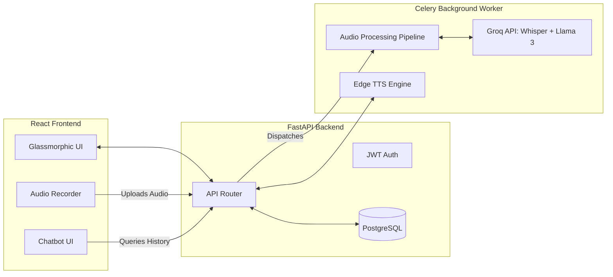

<div align="center">
  
  <h1>Voice Journal AI</h1>
  <p><strong>A beautifully crafted, AI-powered voice journaling platform that analyzes your emotions, tracks your mental well-being, and talks back to you.</strong></p>
  
  <p>
    
    
    
    
  </p>

  <h3>
    <a href="https://voicejournal-orggxnjnn-ankityadav-s-projects.vercel.app" target="_blank">🌐 Try the Live Demo Here</a>
  </h3>
</div>

<br/>

<div align="center">
  
  
  
</div>

<br/>

---

## ✨ Features

- 🎙️ **Voice-First Journaling**: Seamlessly record audio journals directly in your browser. Audio is automatically transcribed using Whisper / Groq API.
- 🧠 **Deep Sentiment Analysis**: Analyzes the semantic context, sarcasm, and tone of your transcripts using **Llama-3.1-8b** to accurately predict your emotional state (Valence & Arousal).
- 📈 **Dynamic Mood Arc**: Watch your mental well-being unfold over time with an interactive, responsive Recharts area graph.
- 🤖 **Empathetic AI Companion**: Chat with a highly personalized AI therapist/friend about your past journal entries.
- 🗣️ **Neural Voice Output**: Features Microsoft Edge Neural TTS for lifelike AI voice responses (Available in English and Hindi!).
- 💎 **Premium Glassmorphic UI**: A stunning, animated interface built with TailwindCSS, pure-CSS animated mesh gradients, and Framer Motion.


## 🔒 Security & Privacy By Design

- **Audio Encryption at Rest**: All uploaded audio files are encrypted using **AES-256** (`cryptography.fernet`) before being saved to disk or S3.
- **Rate Limiting**: API endpoints are strictly rate-limited using `slowapi` to prevent abuse and brute-force attacks.
- **Secure Authentication**: Stateless, expiring JWT tokens are used for authentication with hashed passwords (`bcrypt`).

## 📊 Monitoring & Reliability

- **Unit Tested**: Includes a robust suite of `pytest` unit tests validating all core API functionality and authentication mechanisms.
- **Structured Logging**: Employs `structlog` for machine-readable JSON logs across all incoming API requests.
- **Health Checks**: Features a dedicated `/health` endpoint for continuous uptime monitoring by orchestrators.

## 🔀 Cloud & Local Fallbacks
Designed with flexibility in mind. While it currently uses **Groq** for blazing-fast inference and **Microsoft Edge** for TTS, the architecture supports hot-swapping:
- **Local LLM Fallback**: Easily swap Groq for [Ollama](https://ollama.ai/) to run Llama-3 entirely on-premise.
- **Local TTS Fallback**: Swap the Edge TTS engine for [Suno Bark](https://github.com/suno-ai/bark) for 100% offline neural voice generation.

## 🛠️ Tech Stack

**Frontend (Vercel)**
- React (Vite) + TypeScript
- TailwindCSS (Styling & Glassmorphism)
- Framer Motion (Page transitions & micro-animations)
- Recharts (Data visualization)

**Backend (Render)**
- Python + FastAPI (REST API)
- Celery + Redis (Asynchronous background processing)
- PostgreSQL + SQLAlchemy (Database & ORM)
- Groq API (Blazing fast LLM inference)

---

## 📖 The Motivation: Why Voice Journal?

Traditional journaling is highly beneficial for mental health, but typing out your thoughts when you are overwhelmed, anxious, or exhausted can feel like a chore. **Voice Journal AI** removes the friction of typing, allowing users to simply speak their mind.

By capturing the raw audio, the platform not only transcribes the text, but deeply analyzes the semantic meaning, sarcasm, and tone to build a **longitudinal emotional profile**. This helps users visualize their mental state over time, identify triggers, and reflect on their growth through the help of an empathetic, intelligent AI companion.

---

## 🏗️ System Architecture & Data Flow

Voice Journal AI is designed as a decoupled, scalable, event-driven system.

1. **Audio Ingestion**: The user records an audio journal in the browser using the MediaRecorder API. The audio is sent as a `multipart/form-data` payload to the FastAPI backend.
2. **Immediate Storage**: The backend immediately encrypts the raw audio via AES-256 and saves it to secure storage.
3. **Event Dispatch**: A task is dispatched to the **Celery / Redis** message broker to process the audio asynchronously, allowing the API to return an immediate 202 response to the user.
4. **AI Inference Pipeline**:
   - The Celery worker picks up the task and runs it through the **Whisper API** for highly accurate Speech-to-Text transcription.
   - The generated transcript is then fed into **Llama-3.1-8b** via the Groq API.
   - Llama-3 performs deep semantic analysis, detecting nuances like sarcasm and exhaustion, to output an emotional classification (e.g. "Happy", "Anxious", "Neutral") and a continuous **Valence Score** (-1.0 to +1.0).
5. **Real-time Updates**: The frontend polls for completion and dynamically renders the new journal entry on the dashboard's Recharts trend graph.



### 2. Environment Variables
Create the necessary environment variable files.
```bash
# In the backend directory
cp backend/.env.example backend/.env

# In the frontend directory
echo "VITE_API_URL=http://localhost:8000/api/v1" > frontend/.env
```
*(Make sure to add your `GROQ_API_KEY` to the backend `.env` file!)*

### 3. Run with Docker Compose (Recommended)
You can spin up the entire full-stack application (Postgres, Redis, FastAPI Backend, Celery Worker, and Vite Frontend) using Docker:

```bash
docker compose up --build
```
- Frontend will be available at: `http://localhost:5173`
- Backend API Docs available at: `http://localhost:8000/docs`

### 4. Running Unit Tests
To run the automated test suite locally:
```bash
cd backend
python -m venv venv
source venv/bin/activate
pip install -r requirements.txt
PYTHONPATH=. pytest tests/test_api.py
```

## 🔐 Environment Variables

You will need to set up the following keys in your backend `.env`:
- `DATABASE_URL` (Postgres Connection String)
- `SECRET_KEY` (For JWT token signing)
- `GROQ_API_KEY` (For Llama-3 and Whisper inference)

## 🤝 Contributing
Contributions, issues, and feature requests are welcome! Feel free to check the issues page.

## 📝 License
This project is [MIT](https://choosealicense.com/licenses/mit/) licensed.
