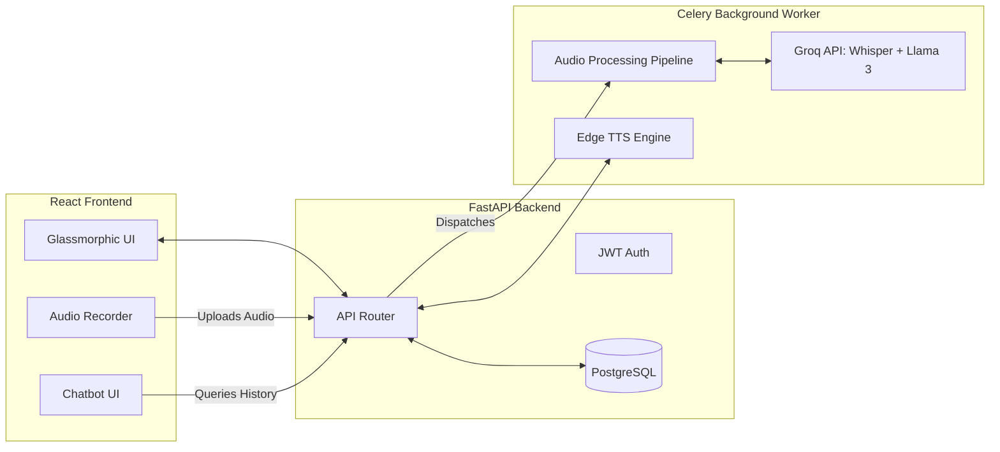

<div align="center">
  
  <h1>Voice Journal AI</h1>
  <p><strong>A beautifully crafted, AI-powered voice journaling platform that analyzes your emotions, tracks your mental well-being, and talks back to you.</strong></p>
  
  <p>
    
    
    
    
  </p>
</div>

<br/>

<div align="center">
  
  
  
</div>

<br/>

---

## ✨ Features

- 🎙️ **Voice-First Journaling**: Seamlessly record audio journals directly in your browser. Audio is automatically transcribed using Whisper / Groq API.
- 🧠 **Deep Sentiment Analysis**: Analyzes the semantic context, sarcasm, and tone of your transcripts using **Llama-3.1-8b** to accurately predict your emotional state (Valence & Arousal).
- 📈 **Dynamic Mood Arc**: Watch your mental well-being unfold over time with an interactive, responsive Recharts area graph.
- 🤖 **Empathetic AI Companion**: Chat with a highly personalized AI therapist/friend about your past journal entries.
- 🗣️ **Neural Voice Output**: Features Microsoft Edge Neural TTS for lifelike AI voice responses (Available in English and Hindi!).
- 💎 **Premium Glassmorphic UI**: A stunning, animated interface built with TailwindCSS, pure-CSS animated mesh gradients, and Framer Motion.

## 🛠️ Tech Stack

**Frontend (Vercel)**
- React (Vite) + TypeScript
- TailwindCSS (Styling & Glassmorphism)
- Framer Motion (Page transitions & micro-animations)
- Recharts (Data visualization)

**Backend (Render)**
- Python + FastAPI (REST API)
- Celery + Redis (Asynchronous background processing)
- PostgreSQL + SQLAlchemy (Database & ORM)
- Groq API (Blazing fast LLM inference)

## 🏗️ System Architecture



## 🚀 Local Development Setup

### 1. Clone the repository
```bash
git clone https://github.com/yourusername/voicejournal.git
cd voicejournal
```

### 2. Backend Setup
```bash
cd backend
python -m venv venv
source venv/bin/activate
pip install -r requirements.txt

# Start the Redis Server (Required for Celery)
redis-server

# Create an .env file
cp .env.example .env

# Start the FastAPI server & Celery worker
./start.sh
```

### 3. Frontend Setup
```bash
cd frontend
npm install

# Create an .env file
echo "VITE_API_URL=http://localhost:8000/api/v1" > .env

# Start the Vite development server
npm run dev
```

## 🔐 Environment Variables

You will need to set up the following keys in your backend `.env`:
- `DATABASE_URL` (Postgres Connection String)
- `SECRET_KEY` (For JWT token signing)
- `GROQ_API_KEY` (For Llama-3 and Whisper inference)

## 🤝 Contributing
Contributions, issues, and feature requests are welcome! Feel free to check the issues page.

## 📝 License
This project is [MIT](https://choosealicense.com/licenses/mit/) licensed.
